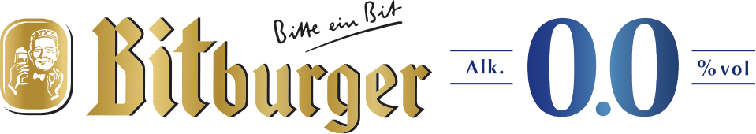

    

        

        

        

        

        <!-- 

 -->
    

### What does “Tech For Good” mean to us?
We want to create solutions for the 99% and not just the 1%, creating value for everyone. Further, our solutions should address an actual and current issue, which we identified in all of our 3 subtopics you will find below. And lastly, we want our solutions to give power to the people and not to only an exclusive group of individuals.

The TechLabs Hackathon is divided into 3 subtopics:
- Mobility
- Recycling & Waste
- Food & Groceries

To each of the subtopics we will present a challenge in the beginning of the hackathon. Afterwards, participants can choose one of them and start working on a solution.

### Who can Apply?
The hackathon is open to everybody who is eager to learn something new, work in a team and is generally interested in participating at this event, though there are some basic requirements we ask for. Having some (basic) experience and knowledge in working with coding languages and hacking tools as well as project management knowledge is recommended and will also make your life a lot easier. No worries if you are no professional Data Scientist – we will have mentors on site that are more than happy to help you out with any questions. Other than that, we are happy to welcome everyone who is ready for a small challenge in a dynamic and motivational environment!

The teams will be formed of groups from 6-8 people, that provide complementary skills to work on a solution. Teams will be formed at the event, so no worries if you are planning to participate by yourself. We will further provide an open slack channel for participants to connect and get to know each other. As can be seen in the preliminary agenda below, we will also use the Friday evening to introduce the participants to each other and have a first relaxed get-together with some drinks.

In the end, to successfully close your hard work, you will pitch your project at the end to a jury, who will announce a winner and reward them with a prize. But, again, no worries in case the project is not finished at the end – the hackathon is all about gaining experience and having fun, working on effective solutions.

Besides the hacking phase we will organize evening drink and social events to gather together and enjoy each other. You will meet motivated and interesting people, that are open to meeting new people with similar interests. Having a fun time is the absolute goal for this weekend!

If you feel inspired and interested in this experience, do not hesitate and sign up with the application form below! We will get back to you with further information and are looking forward to an amazing weekend.

**What?** Data-driven innovation hackathon for data/computer science, business, engineering, and other students in general, who are interested!

**Where?** In-Person, at the CET Dortmund location

**When?** 17th-19th June 2022

**How many?** Max. 60 participants
<ul class="actions">
    <li><a href="https://docs.google.com/forms/d/e/1FAIpQLSd2tDdalzrrjpD36jojuFZdMIIvYG3mYrypHNnkI-fx11hEyQ/viewform?usp=sf_link" class="button next scrolly">Register here</a></li>
</ul>

### Preliminary Agenda:

#### FRIDAY 17th:
6pm: Arrival of participants  
7pm: Welcome speech + Topic presentation  
7:30pm: Getting to know each other and group formation  

#### SATURDAY 18th:
9am: Breakfast  
10am: Ideation workshop  
11am: Start hacking phase  
1pm: Lunch  
2pm-7pm: Hacking phase with mentor support  
7pm: Dinner + Easy drinks  

#### SUNDAY 19th:
9am: Breakfast  
10: Hacking phase and preparation for presentations  
12pm: Lunch + further preparation for presentation  
2pm: Project presentations  
4pm: Winner announcement Speech and Drinks  

### About the Location
The Centre for Entrepreneurship & Transfer (CET) at TU Dortmund University supports and accompanies start-ups in all phases, offers courses and workshops on the topics of entrepreneurship, technology and innovation and stimulates the transfer of technology and knowledge from science into practice. With our measures, we want to establish a new start-up spirit in Dortmund, the Westphalian Ruhrregion and South-Westphalia, strengthen the local innovative power and thus make the region sustainably fit for the future.

### Partners and Sponsors

    

        

        

        

        

    

